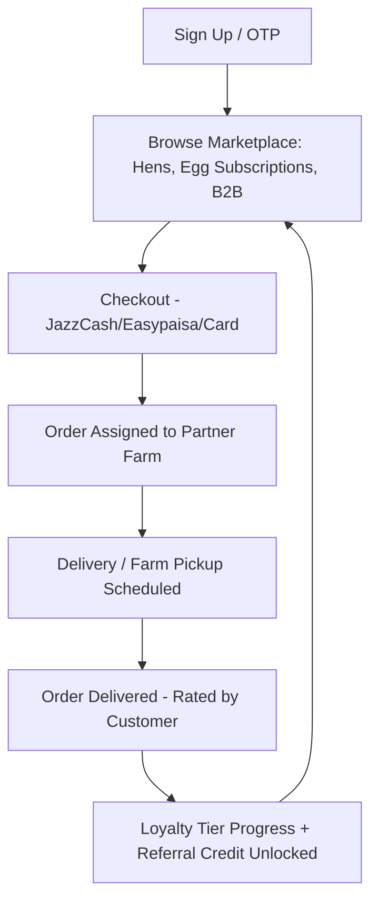

# HenFarm — Real Poultry Marketplace & Referral Growth Plan

> **Project Root**: `d:\personal-projects\hen-and-egg-app`
> **Model Type**: Real Marketplace (Hens, Eggs, B2B Wholesale) + Honest Referral Program
> **Replaces**: earlier fixed-daily-return / investment-style draft (removed — see note below)

---

## Why this version is different

The earlier draft promised a **fixed daily return** on a "digital hen" (Rs 35/day, +288% in 90 days) plus a multi-level referral commission paid out of new users' deposits. That structure is not sustainable at any scale — no real poultry operation produces a guaranteed 288% return in 90 days, and once payouts depend on new deposits instead of real sales, the model collapses the day signups slow down (this is exactly what happened to Egglix). It also runs into deposit-taking/collective-investment-scheme regulation regardless of intent.

This version keeps the parts of the idea that are genuinely good — **real hens, real eggs, a referral program that rewards bringing in customers** — and removes anything whose payout depends on a chain of future deposits rather than a real, delivered product.

**Golden rule for every feature below:** a reward only exists if it's paid for out of margin on a completed, delivered sale. Nothing is ever paid out of the next customer's money.

---

## 1. Core Products (what actually gets sold)

| Product | What the customer gets | Revenue source |
| :--- | :--- | :--- |
| **Retail Hen Purchase** | A real, tagged, point-of-lay hen, delivered or raised at a partner farm with visible batch/farm ID | Markup between farm-gate cost and retail price |
| **Egg Subscription** | Fixed weekly/monthly egg delivery (e.g. "12 eggs/week") | Recurring subscription margin |
| **B2B Wholesale** | Bulk eggs supplied to bakeries, hotels, marts | Wholesale margin + platform fee |
| **Farm Partner Panel** | Verified farms list capacity, log production, get paid per fulfilled order | Take-rate / commission per transaction |

No product promises a return on money deposited. Every product is a thing the customer receives.

---

## 2. Referral Program (the part you asked to improve — kept, made honest)

Two reward types, both **one-time**, both **paid from real order margin**, both capped:

### A. Instant "bring a friend" discount
- Referrer shares a code. When the referred friend **completes a real purchase** (not just signup), both get a one-time reward:
  - Referred friend: 10% off their first order
  - Referrer: Rs 100–150 credit (or a discount voucher) toward their next order
- This is funded the same way any shop funds a "bring a friend" flyer — out of that order's margin, as a customer-acquisition cost you already control.

### B. Milestone reward — the "10 referrals = 1 free hen" idea, made real
- **Refer 10 friends who each complete a real, paid order → get 1 free hen (or equivalent egg-tray voucher), delivered physically from real inventory.**
- Key difference from the old version: this hen is **not funded by the 10 friends' money** — it's funded by the platform's marketing budget, exactly the way a coffee shop funds "buy 10, get the 11th free." You already know your cost-per-acquisition; this is just that budget handed out as a physical reward instead of a discount code.
- **No further tiers, no ongoing commission, no cut of what the referred friend earns or buys later.** One level deep, one-time, done. This is the line that keeps it a marketing program instead of a recruitment scheme.

### Unit economics check (so you can see it's sustainable before building it)
```
Assume: average order margin = Rs 250, cost of 1 free hen reward = Rs 500

10 completed referred orders → 10 × Rs 250 margin = Rs 2,500 earned
Cost of milestone reward (1 free hen)             = Rs 500
Net platform profit on that milestone cohort      = Rs 2,000
```
Because the reward is smaller than the margin it took to earn it, the program is self-funding at any scale — it works the same whether you have 10 users or 10 million. That's the test every reward in this program must pass before it ships.

---

## 3. Loyalty Tiers (based on buying, not recruiting)

| Tier | Requirement | Benefit |
| :--- | :--- | :--- |
| Bronze | First purchase | Standard pricing |
| Silver | 5+ completed orders | 5% off future orders |
| Gold | 15+ completed orders or 1 active subscription | 10% off + priority delivery slot |
| Platinum | B2B / bulk buyer | Dedicated account + negotiated wholesale rate |

Tiers reward **being a good customer**, not bringing in other depositors — this keeps growth tied to real transaction volume.

---

## 4. App Flow



---

## 5. What NOT to build (guardrails, kept from our discussion)

- ❌ No fixed/guaranteed daily or periodic "yield" on money held by the app.
- ❌ No reward that is paid out of another user's deposit rather than realized order margin.
- ❌ No multi-level commission on a referred user's future purchases or earnings — one level, one-time only.
- ❌ No "invest the money elsewhere, pay returns from that" mechanic — if you ever want a real trading/investment fund, that is a separate, SECP-licensed product, not a feature bolted onto this marketplace.

---

## 6. Next Steps

1. Confirm real farm-gate cost vs retail price for hens and eggs (needed to size referral rewards realistically).
2. Design DB schema: `orders`, `referrals`, `loyalty_tiers`, `farm_partners` (current `lib/db/src/schema` is still an empty scaffold — nothing to migrate away from).
3. Build referral code generation + one-time-redemption tracking (must enforce: referral credit only unlocks after order status = `delivered`/`fulfilled`, never on signup).
4. Build farm partner panel for order fulfillment + inventory visibility.
